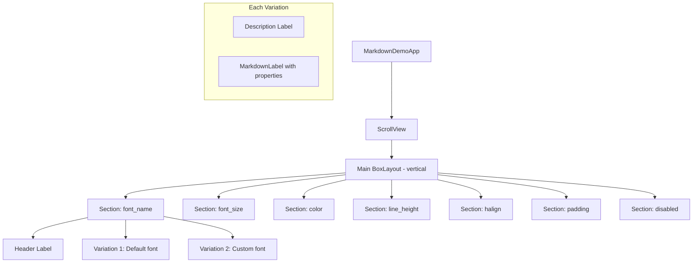

# Design Document: MarkdownLabel Label Compatibility Demo

## Overview

This feature updates the Kivy Markdown Demo App to showcase the new Label-compatible properties added to MarkdownLabel. The app will be restructured from a single MarkdownLabel displaying a markdown file to a multi-section demo that displays property variations side-by-side for visual verification.

The demo will cover:
- `font_name` - Custom font selection
- `font_size` - Font size (alias for base_font_size)
- `color` - Text color
- `line_height` - Line spacing
- `halign` - Horizontal alignment (left, center, right, justify)
- `padding` - Container padding
- `disabled` / `disabled_color` - Disabled state styling

## Architecture



### Layout Structure

Each section follows a consistent pattern:
1. **Section Header** - Large bold label identifying the property
2. **Variations** - Multiple MarkdownLabel instances with different property values
3. **Description Labels** - Text indicating the specific property values used

## Components and Interfaces

### Main Application Structure

```python
class MarkdownDemoApp(App):
    """Demo app showcasing MarkdownLabel Label-compatible properties."""
    
    def build(self):
        """Build scrollable layout with property demonstration sections."""
        pass
    
    def create_section(self, title: str, variations: list) -> BoxLayout:
        """Create a section with header and variations.
        
        Args:
            title: Section header text
            variations: List of (description, property_dict) tuples
        
        Returns:
            BoxLayout containing the section
        """
        pass
    
    def create_variation(self, description: str, **properties) -> BoxLayout:
        """Create a single MarkdownLabel variation with description.
        
        Args:
            description: Text describing the property values
            **properties: Properties to apply to MarkdownLabel
        
        Returns:
            BoxLayout containing description and MarkdownLabel
        """
        pass
```

### Sample Content

A consistent sample markdown string will be used across all variations:

```python
SAMPLE_MARKDOWN = """## Sample Heading

This is a paragraph with some text to demonstrate the property. It includes `inline code` for testing code font preservation.

Another paragraph to show line spacing effects."""
```

### Section Configurations

| Section | Variations |
|---------|-----------|
| font_name | Default (Roboto), Custom font |
| font_size | 14sp, 20sp, 28sp |
| color | White, Yellow, Cyan |
| line_height | 1.0, 1.5, 2.0 |
| halign | left, center, right, justify |
| padding | [0,0,0,0], [20,20,20,20], [40,10,40,10] |
| disabled | Normal, Disabled with custom disabled_color |

## Data Models

### Variation Configuration

```python
# Each variation is a tuple of (description, properties_dict)
FONT_NAME_VARIATIONS = [
    ("font_name='Roboto' (default)", {"font_name": "Roboto"}),
    ("font_name='DejaVuSans'", {"font_name": "DejaVuSans"}),
]

FONT_SIZE_VARIATIONS = [
    ("font_size=14", {"font_size": 14}),
    ("font_size=20", {"font_size": 20}),
    ("font_size=28", {"font_size": 28}),
]

COLOR_VARIATIONS = [
    ("color=[1,1,1,1] (white)", {"color": [1, 1, 1, 1]}),
    ("color=[1,1,0,1] (yellow)", {"color": [1, 1, 0, 1]}),
    ("color=[0,1,1,1] (cyan)", {"color": [0, 1, 1, 1]}),
]

LINE_HEIGHT_VARIATIONS = [
    ("line_height=1.0", {"line_height": 1.0}),
    ("line_height=1.5", {"line_height": 1.5}),
    ("line_height=2.0", {"line_height": 2.0}),
]

HALIGN_VARIATIONS = [
    ("halign='left'", {"halign": "left"}),
    ("halign='center'", {"halign": "center"}),
    ("halign='right'", {"halign": "right"}),
    ("halign='justify'", {"halign": "justify"}),
]

PADDING_VARIATIONS = [
    ("padding=[0,0,0,0]", {"padding": [0, 0, 0, 0]}),
    ("padding=[20,20,20,20]", {"padding": [20, 20, 20, 20]}),
    ("padding=[40,10,40,10]", {"padding": [40, 10, 40, 10]}),
]

DISABLED_VARIATIONS = [
    ("disabled=False (normal)", {"disabled": False}),
    ("disabled=True, disabled_color=[0.5,0.5,0.5,1]", {
        "disabled": True,
        "disabled_color": [0.5, 0.5, 0.5, 1]
    }),
]
```

## Correctness Properties

*A property is a characteristic or behavior that should hold true across all valid executions of a system-essentially, a formal statement about what the system should do. Properties serve as the bridge between human-readable specifications and machine-verifiable correctness guarantees.*

### Property 1: Consistent Sample Content
*For any* MarkdownLabel variation in the demo app, the text property SHALL contain the same sample markdown content including a heading, paragraph, and inline code.
**Validates: Requirements 9.1, 9.2**

### Property 2: Section Structure Completeness
*For any* property section in the demo app, the section SHALL contain a header label and at least two MarkdownLabel variations with different property values.
**Validates: Requirements 1.1, 2.1, 3.1, 4.1, 6.1, 7.1, 8.2**

### Property 3: Variation Description Accuracy
*For any* MarkdownLabel variation, the description label SHALL accurately reflect the property values set on the corresponding MarkdownLabel widget.
**Validates: Requirements 1.2, 2.2, 3.2, 4.2, 5.2, 6.2, 7.2, 8.3**

## Error Handling

| Error Condition | Handling Strategy |
|-----------------|-------------------|
| Missing font | Kivy falls back to default font |
| Invalid color format | Kivy property validation raises error at startup |
| Invalid halign value | OptionProperty raises ValueError |

## Testing Strategy

### Dual Testing Approach

- **Unit tests**: Verify app structure, widget properties, and section configurations
- **Property-based tests**: Verify consistent content across all variations

### Property-Based Testing Framework

The project uses **Hypothesis** for Python property-based testing.

Configuration:
- Minimum 100 iterations per property test
- Tests verify structural properties of the demo app

### Test Annotation Format

Each property-based test MUST be annotated with:
```python
# **Feature: markdownlabel-label-compatibility, Property {number}: {property_text}**
```

### Unit Test Coverage

1. **App Structure Tests**
   - Verify ScrollView as root widget
   - Verify main BoxLayout contains all sections
   - Verify each section has header and variations

2. **Property Configuration Tests**
   - Verify font_name variations have different font_name values
   - Verify font_size variations have different font_size values
   - Verify color variations have different color values
   - Verify halign section covers all four alignment options
   - Verify disabled section has both enabled and disabled widgets

3. **Content Tests**
   - Verify sample content contains heading markdown
   - Verify sample content contains paragraph text
   - Verify sample content contains inline code
